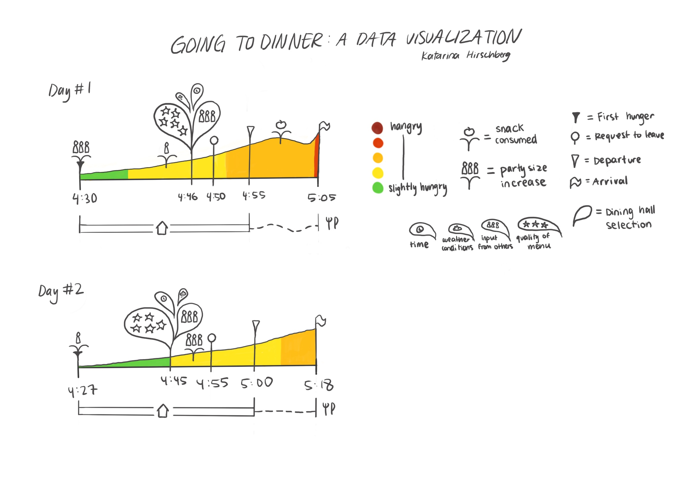

<!DOCTYPE html>
<html lang="en">
    <body>
        <h1>Going to Dinner: A Data Visualization</h1>
        <h2>By: Katarina Hirschberg</h2>
        
This data visualization tells a story about a process I have to go through every single day: going to dinner. While this may not seem interesting at first, creating the visualization revealed that there are in fact a variety of different factors that all come together in complex ways. As the information designer Giorgia Lupi has stated, “the phenomena that rule our world are by definition complex, multifaceted and mostly difficult to grasp” (Lupi, n.d.), so data visualizations should be complex, including both quantitative and qualitative data, combining multiple visual narratives, with a visual complexity and richness of information that encourage the reader to read slowly and engage with the data on a deeper level. By doing this, the designer challenges the impartial, reductive and oversimplified data visualizations often created today. In her article “Sketching with Data Opens the Mind’s Eye”, Lupi describes her process. She says that she always starts by sketching. First she creates a broad sketch in order to understand the topic, and the “overall organization of the information” (Lupi, 2016). Next she focuses on a single data point in order to “figure out which shapes, colors, features we might adopt or invent to better represent them” (Lupi, 2016). Finally, in the third step, she combines the broad visualization with the specific data points into one final design.

        
I emulated Giorgia Lupi’s process of creating a data visualization. I made a variety of sketches, using my pencil to figure out how to best represent the data. This step was challenging but required me to engage with the data and understand relationships between different variables. My visual elements and design were inspired by Lupi’s “Dear Data” visualizations. I used procreate to draw a final version and GitHub to upload it onto the web.

        
        
My dataset includes a variety of factors. First a timeline of the decisions and actions involved in deciding when and where to eat dinner: the first time I feel hungry, deciding where to eat, when I want to leave, when I actually leave, and when I arrive. This data is quantitative and includes specific times. The decision of where to eat is based upon four variables: quality of the meal, input from friends, weather conditions, and time. I also included other events that influence this process, such as when someone joins the party or when I consume a snack. Paralleling my journey to the dining hall I included the locations I was at during the process. Finally comes the main section of the visualization which is a graph that indicates my hunger level.

        
My data visualization is thus a combination of qualitative and quantitative data, layers multiple visualizations together and tells a complex and unique story. The goal of my visualization was to create a multilayered visualization that reflected the complexity of my dinnertime process so that the reader engages with the data in a deeper way. A limitation of this is that my process is primarily based on one source: Lupi’s visualization process, which can be rectified by reading other scholars. Additionally, the data I used from my own subjective experiences. In the future, now that I have understood the process, I would use a different dataset.

    </body>
    <h2>References</h2>
    <li>Data Humanism, The Revolution will be Visualized. (n.d.). Giorgialupi. Retrieved March 28, 2025, from http://giorgialupi.com/data-humanism-my-manifesto-for-a-new-data-wold</li>
    <li>Lupi, G. (2016, February 16). Sketching with Data Opens the Mind’s Eye. Medium. https://medium.com/accurat-in-sight/sketching-with-data-opens-the-mind-s-eye-92d78554565</body></li>
</html>
